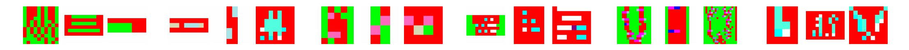
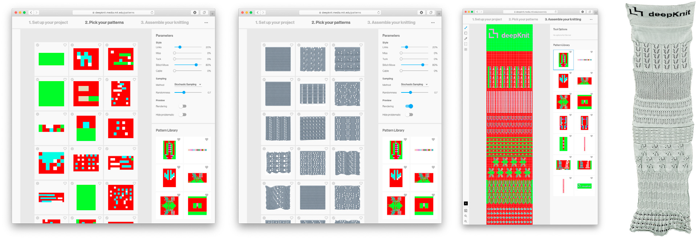

# deepKnit

**Learning-based Generation of Machine Knitting Code**

Modern knitting machines allow the manufacturing of various textile products with complex surface structures and patterns. However, programming these machines requires expert knowledge due to constraints of the process and the programming language. In our [paper](https://authors.elsevier.com/sd/article/S2351-9789(20)31925-9) we present a long short-term memory (LSTM) based deep learning model that generates low-level code of novel knitting patterns based on high-level style specifications. This repository contains some source code of the presented model and design tool.

## LSTM Model

While we are not allowed to share our dataset due to copyright constraints, we do share all the code that we used for our model. It can be found in [model-server/src/lstm.py](./model-server/src/lstm.py) and includes preprocessing steps, the model architecture and methods for training, sampling and evaluation. 

## KnitPaint Utilities and Knit Check

We provide a set of utility methods that allow easier handling of KnitPaint code in Python and NumPy. A detailed description can be found in [model-server/src/knitpaint](./model-server/src/knitpaint). While we had to remove our implementation to read and write the proprietary "dat" and "lep" file format, the class provides a set of methods to load and save other formats and transform existing KnitPaint code.

In particular, we provide our implementation of the knit check that we use to measure the performance of our model. Our implementation allows to check an existing pattern for correctness and is able to describe if and where problems occur. Readers are encouraged to look at our [virtual knitting machine](./model-server/src/knitpaint/check/virtual_knitting_machine.py) and our [test cases](./model-server/src/knitpaint/check/tests) to gain an understanding how KnitPaint code converts to machine instructions.

## Design Tool

We also share the source code of our web-based design tool that allows to generate patterns using our model and assemble them to a swatch. It can be started using [Docker](https://www.docker.com) by cloning the repository and running `docker-compose up`. Once started, the design tool is available at [http://localhost:5000](http://localhost:5000). The preview functionality is not available in the Docker version, as it needs to be executed on a dedicated knit design system.

